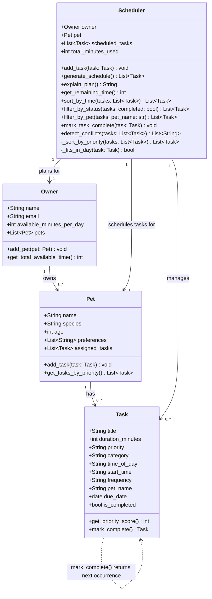

# PawPal+ — Final UML Class Diagram

Paste the Mermaid code below into [mermaid.live](https://mermaid.live) to render it,
or use any Markdown viewer that supports Mermaid fenced code blocks.

## Changes from initial UML

| What changed | Why |
|---|---|
| `Task` gained `start_time`, `frequency`, `pet_name`, `due_date` | Needed for time-based sorting, recurring logic, per-pet filtering, and next-occurrence date math |
| `Task.mark_complete()` now returns `Task` (next occurrence) | Recurring support — returns `None` for one-off tasks |
| `Scheduler` gained `sort_by_time`, `filter_by_status`, `filter_by_pet`, `mark_task_complete`, `detect_conflicts` | Phase 3 algorithmic layer — sorting, filtering, recurrence, and conflict detection |
| Self-referential `Task ..> Task` dependency added | `mark_complete()` creates and returns a new `Task` instance |
